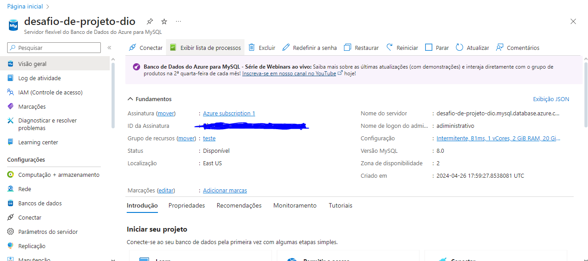

# Processando e Transformando Dados com Power BI

## Passo 01 – Criação da instância Azure DB

1-Primeiro eu fiz a criação de uma instância na Azure para MySQL, logo depois fiz integração do Power BI com MySQL no Azure..

## Passo 02 – Trasnformação de dados os Dados

Exclusão de todas as colunas my_row_id

Mudando o valor de Super_Ssn de NULL para 0 na tabela employee.

Mudando o tipo de dados da coluna Salary para decimal fixo em employee.

Mudando o tipo de dados da coluna Dno para texto em project.

Mudando o tipo de dados da coluna Pnumber e Dnum para texto em project.

Mudando o tipo de dados da coluna Dnumber para texto em departament.

Mudando o tipo de dados da coluna Dnumber para texto em deppt_locations.

Mudando o tipo de dados da coluna Pno para texto em works_on.

O employee com Super_Ssn com valor 0 é o gerente.

Todos os departamentos possuem um gerente associado.

Depois eu fiz o mesclar consultas(extrema esquerda) employee e departament para criar uma tabela employee com o nome dos departamentos associados aos colaboradores. A mescla terá como base a tabela employee.

Depois mesclei as colunas de Nome e Sobrenome para ter apenas uma coluna definindo os nomes dos colaboradores.

Depois eu fiz o mesclar consultas(extrema esquerda) departament e dept_locations para logo depois mesclar os nomes de departamentos e localização.

O mesclar combina as tabelas com base em uma coluna de junção (como o comando join no SQL), neste caso a atribuição não seria útil em juntar as informações de duas colunas de tabelas diferentes, só se o objetivo fosse empilhar tabelas verticalmente (ou seja, adicionar mais linhas na tabela indiferente das colunas, o que é útil ao incluir mais dados que advém da mesma estrutura de colunas).

Exclui azure dept_locations.Dnumber

## Passo 02 – Distribruição de colunas:

## Obs:

Tive que criar as tabeles sem constraint e relacionamentos, pois quando eu colocava igual estava no repositório no git hub, no Power Bi algumas tabelas ficavam vazias.

